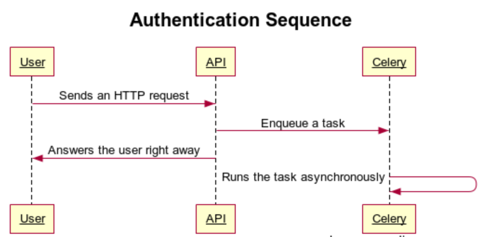

# Background Jobs

When building an API, sometimes the work that needs to be done in the Controller receiving an HTTP request might take a long time (think more than 1 second). That could be sending an email (SMTP is a slow protocol), updating a lot of records in the database, calling another API which might take some time to respond, etc.

We will use the [Celery](http://www.celeryproject.org/) project which provides a **distributed task queue** to run these background jobs. Here's a sequence diagram of what we want to do:

