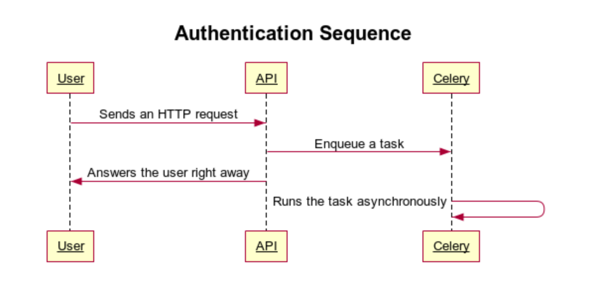
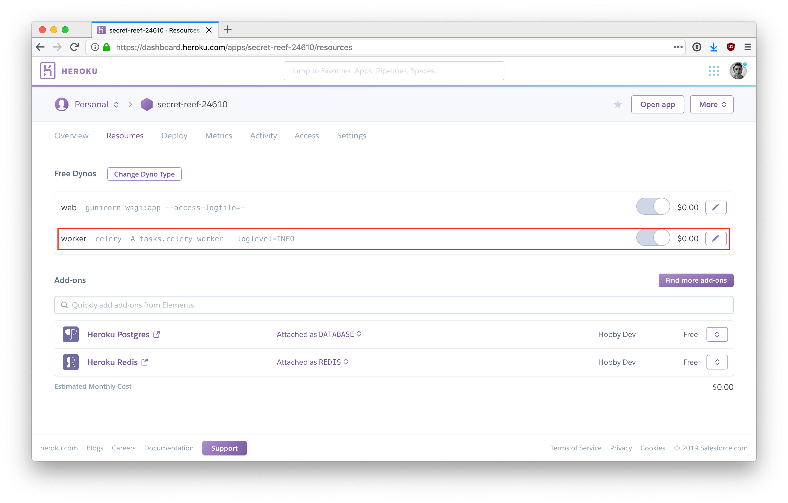

# Background Jobs

When building an API, sometimes the work that needs to be done in the Controller receiving an HTTP request might take a long time (think more than 1 second). That could be sending an email (SMTP is a slow protocol), updating a lot of records in the database, calling another API which might take some time to respond, etc.

We will use the [Celery](http://www.celeryproject.org/) project which provides a **distributed task queue** to run these background jobs. Here's a sequence diagram of what we want to do:



Let's try to put that in place into our Flask Application

## Setup

Once again, we can use our product app to test the `celery` package:

```bash
cd ~/code/<github_username>/flask-with-sqlalchemy
```

Make sure your `git status` is clean and don't forget to work in a branch! As you might have worked in the `experiment-with-flask-admin`, you might want to commit this branch, push it to GitHub to archive it and then go back to master. You could also open a Pull Request, ask you buddy to review it, merge it and then `pull` `master` locally on your computer.

```bash
# Make sure `git status` is clean.
git checkout master
git pull origin master
git checkout -b celery
```

Before jumping in the code, please read the [Introduction to Celery](http://docs.celeryproject.org/en/latest/getting-started/introduction.html) from the documentation to have an overview.

We will use [**Redis**](https://redis.io/) for the Celery back-end. This is another service we need to install on Windows and run it so that our app works. Please [download](https://github.com/dmajkic/redis/downloads) the latest Redis compiled for Windows. Then launch it (under `64bits/redis-server.exe`) in a separate Terminal window.

Now that we have the Redis service running in the background, we can proceed with the code. First install Celery and its Redis dependency:

```bash
pipenv install celery[redis]
```

Open the `.env` file and add a new environment variable:

```bash
# .env
REDIS_URL="redis://localhost:6379"
```

We also need to prepare the application config with two new variables for the Celery Broker and Result backends. We will use `REDIS_URL` for both:

```python
# config.py
import os

class Config(object):
    # [...]
    CELERY_RESULT_BACKEND = os.environ['REDIS_URL']
    CELERY_BROKER_URL = os.environ['REDIS_URL']
```

Then following the [Flask documentation's article on Celery](http://flask.pocoo.org/docs/1.0/patterns/celery/), we find out that we need to create a **factory** method for Celery.

```bash
touch tasks.py
```

```python
# tasks.py
from celery import Celery
from app import create_app

def make_celery(app):
    celery = Celery(
        app.import_name,
        backend=app.config['CELERY_RESULT_BACKEND'],
        broker=app.config['CELERY_BROKER_URL']
    )
    celery.conf.update(app.config)

    class ContextTask(celery.Task):
        def __call__(self, *args, **kwargs):
            with app.app_context():
                return self.run(*args, **kwargs)

    celery.Task = ContextTask
    return celery

celery = make_celery(create_app())
```

We've just created the boilerplate code to run the Celery service. No background task has been defined yet. Still, we can launch the service to make sure everything is working properly:

```bash
pipenv run celery -A tasks.celery worker --loglevel=INFO
```

You should see something along those lines:

```
Loading .env environment variables…

 -------------- celery@Macbook v4.3.0 (rhubarb)
---- **** -----
--- * ***  * -- Darwin-18.2.0-x86_64-i386-64bit 2019-04-04 15:42:38
-- * - **** ---
- ** ---------- [config]
- ** ---------- .> app:         wsgi:0x103c4a438
- ** ---------- .> transport:   redis://localhost:6379//
- ** ---------- .> results:     redis://localhost:6379/
- *** --- * --- .> concurrency: 4 (prefork)
-- ******* ---- .> task events: OFF (enable -E to monitor tasks in this worker)
--- ***** -----
 -------------- [queues]
                .> celery           exchange=celery(direct) key=celery

[tasks]

[2019-04-04 15:42:38,497: INFO/MainProcess] Connected to redis://localhost:6379//
[2019-04-04 15:42:38,508: INFO/MainProcess] mingle: searching for neighbors
[2019-04-04 15:42:39,529: INFO/MainProcess] mingle: all alone
[2019-04-04 15:42:39,543: INFO/MainProcess] celery@Macbook ready.
```

If not, check that Redis server is running! If you can't get it working, ask your buddy or a TA!

## Adding a very first task

You can now `Ctrl` + `C` (twice) the Celery process.

It's time to add a first task. Go back to Sublime Text in the `tasks.py` file and add the bottom define a function. This function should be a long-running task as it's going to be executed by the worker. To simulate one, we can use [`time.sleep()`](https://stackoverflow.com/questions/510348/how-can-i-make-a-time-delay-in-python).

We will decorate this task with `@celery.task()` so that the Celery process is aware of it.

```python
# tasks.py

# [...]

@celery.task()
def very_slow_add(a, b):
    import time
    time.sleep(3)
    return a + b
```

We've just implemented a `very_slow_add(a, b)` method. Let's test it!

Relaunch the Celery worker with:

```bash
pipenv run celery -A tasks.celery worker --loglevel=INFO
```

This time you should see that the rask has been detected:

```bash
# [...]
[tasks]
  . tasks.very_slow_add
# [...]
```

Open another terminal window and launch a Flask Shell:

```bash
pipenv run flask shell
```

And now we will **enqueue** our first job!

```python
from tasks import very_slow_add
job = very_slow_add.delay(5, 7)
response = job.wait()
```

The `response` should take exactly 3 seconds to return. Look at the logs from the Celery worker, you should see the job get enqueued, be processed, and then return a result!

```bash
[... INFO/MainProcess] Received task: tasks.very_slow_add[7da941c2-...]
[... INFO/ForkPoolWorker-2] Task tasks.very_slow_add[7da941c2-...] succeeded in 3.00225233499998s: 12
````

That's it! You now know how to create function to be run by Celery as tasks, and enqueue them! You can add them to the `wsgi.py` in the method receiving the HTTP requests for your API. They won't block the execution of the thread and keep your API endpoints fast:

```python
# wsgi.py

# [...]

@app.route('/products')
def products():
    from tasks import very_slow_add
    very_slow_add.delay(1, 2) # This pushes a task to Celery and does not block.

    products = db.session.query(Product).all()
    return products_schema.jsonify(products)
# [...]
```

Open (once again!) another terminal window and launch the Flask server:

```bash
FLASK_ENV=development pipenv run flask run
```

Go to [`http://localhost:5000/products`](http://localhost:5000/hello) and watch the Celery logs. Can you see the job getting enqueued without slowing down your API endpoint?

## Deployment

We are almost done with Celery, one last point we need to cover is **deployment**. It can get a tiny bit confusing, let's just recap what we need:

1. We need Redis to be up and running on the host (so we need that too on Heroku!)
2. We need to run the `celery` in a separate process (same for Heroku!)
3. We need to configure the app with environment variables so that Celery finds Redis

For point `1.`, we need to add an **add-on** on our Heroku app. We will use [Heroku Redis](https://elements.heroku.com/addons/heroku-redis) which is free up to 25M, enough to tinker.

```bash
heroku addons:create heroku-redis:hobby-dev
```

This will automatically solve point `3.`, something we can check with:

```bash
heroku config
```

Can you see the `REDIS_URL` on Heroku?

To solve point `2.`, we need to update the `Procfile` with a **new line**:

```yaml
# Procfile
worker: celery -A tasks.celery worker --loglevel=INFO
```

The Procfile will now have 3 lines, a `web` to launch the flask app, a `release` to automatically upgrade the database at each deployment and now a `worker` one to run Celery!

It's now time to push our Branch to Heroku:

```bash
git add .
git commit -m "Add Celery and configure Heroku"
git push heroku celery:master
```

By default, Heroku only starts a [dyno](https://www.heroku.com/dynos) for the `web` process. We need to tell it to also start a `worker` one:

```bash
heroku ps:scale worker=1 web=1
```

You can check that this has been activated on your Heroku dashboard for your app. You should see something along those lines:



Let's observe our application in the wild. Launch the following command to observe production logs:

```bash
heroku logs --tail
```

Then `heroku open` and go to `/products`. Observe your log. Can you see the task getting enqueued and the result being process? Awesome job :clap: !
